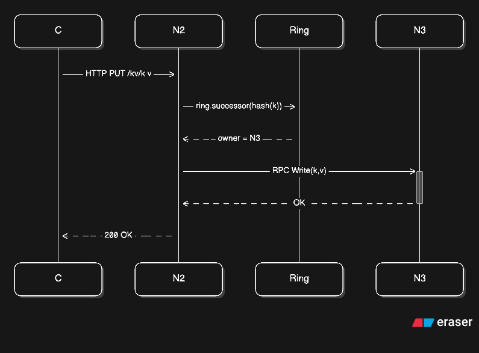
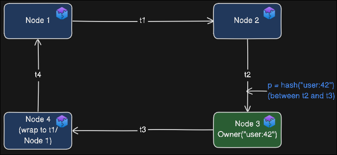

# ZephyrCache

## Quick start
```bash
# Run with default configuration (1 cache node, 1 etcd node, default docker network)
docker-compose -f deploy/docker-compose.yml up -d

# Test the cluster
curl localhost:8080/healthz
curl -X PUT localhost:8080/kv/foo -d 'bar'
curl localhost:8080/kv/foo

# Scale to more cache nodes
docker-compose -f deploy/docker-compose.yml up -d --scale node=10
docker-compose -f deploy/docker-compose.yml up -d --scale node=50
```


## Viewing logs
```bash
# View logs from all nodes in real-time
docker-compose -f deploy/docker-compose.yml logs -f node

# View logs from all services (etcd + nodes)
docker-compose -f deploy/docker-compose.yml logs -f

# View logs from a specific container
docker logs -f deploy-node-1

# View last 100 lines
docker-compose -f deploy/docker-compose.yml logs --tail 100 node
```

## Stopping the cluster
```bash
# Stop all containers
docker-compose -f deploy/docker-compose.yml down
```

## etcd Lease Sequence
Registering all nodes in etcd on startup enables critical features such as request forwarding and health monitoring.


- Each node registers its membership information in etcd under a single lease (e.g., `leaseID 0x1234`)
- All ephemeral membership keys for that node are attached to this lease, ensuring atomic cleanup on failure
- `KeepAlive` operates as a long-lived bidirectional gRPC stream implemented in the etcd client; nodes send heartbeat pings approximately every TTL/3 to maintain the lease
- When a lease expires (no heartbeat received within TTL) or is explicitly revoked, etcd automatically deletes all bound keys and emits watch events to all peers monitoring `/zephyr/nodes`
- Peer nodes receive these watch events and update their local membership view accordingly

### Known Limitations
- **Single Point of Failure**: etcd cluster outages prevent new nodes from joining and may cause cascading failures
- **Network Sensitivity**: Transient network issues can trigger false-positive failure detections
- **Scalability**: Watch event fanout becomes expensive with large clusters (>100 nodes)

### Planned solution
- Gossip protocol for cluster membership with dynamic trust and reputation scoring.
- Phi accrual failure detection.

## Request Forwarding
Clients can send requests to any node in the cluster without needing to know which node owns the data.



## Consistent Hashing
Each node uses consistent hashing to route requests to the correct owner:

**How it works:**
- The hash ring spans positions from 0 to 2^m-1
- Each node is assigned one or more token positions (t1, t2, t3, t4) on the ring
- When a key arrives, hash(k) maps it to a position p on the ring
- The owner is the first node found traveling clockwise from position p

**Example:**

